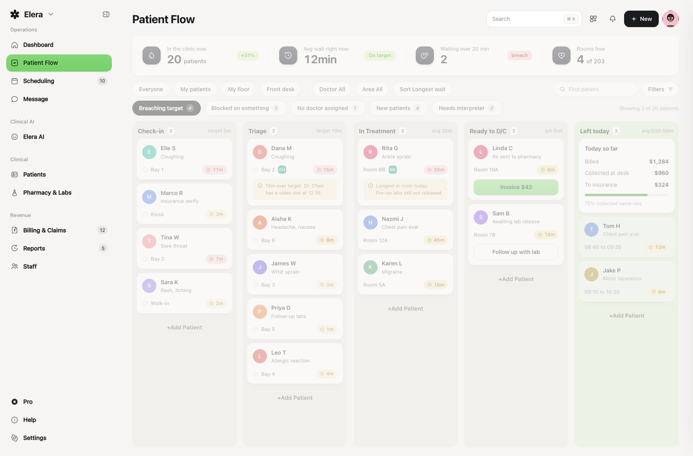

# Elera · Patient Flow

A pixel-faithful replica of the **Elera** clinic operations console — a live patient-flow kanban for front-desk and care teams — rebuilt with vanilla HTML / CSS / JavaScript. Zero dependencies, fully offline.



## Highlights

- **1:1 Patient Flow board** — stats bar, filter chips, quick filters, five-stage kanban (Check-in → Triage → In Treatment → Ready to D/C → Left today), all matching the reference shot down to pill tiers and note cards
- **Drag & drop** between stages with a floating ghost, dashed drop slots and FLIP reflow animations
- **Live simulation** — walk-ins arrive, waits tick up, labs release; every counter recomputes from real state (pause it in *Filters ▸ Live simulation*)
- **⌘K command palette** — jump to any patient or fire actions from anywhere
- **Patient drawer** — stage journey timeline, flags, care notes, advance / check-out actions
- **Add patient modal**, invoice collection, lab follow-up, toasts & notification feed
- **13 working modules** — Dashboard, Scheduling (day agenda), Message (chat with replies), Elera AI (answers questions about the live floor), Patients table, Pharmacy & Labs (releases unblock the board), Billing & Claims (collects sync with the green column), Reports, Staff, Pro, Help, Settings (accent themes, density, rail)

## Run

Open `index.html` directly, or serve the folder:

```bash
python3 -m http.server 4173
# → http://localhost:4173
```

## Keyboard

| Keys | Action |
| --- | --- |
| `⌘K` / `Ctrl K` | Command palette |
| `Esc` | Close overlay |
| `↵` | Submit modal / palette item |

## Structure

```
elera-patient-flow/
├── index.html   # shell: sidebar, topbar, overlay roots
├── styles.css   # design tokens sampled from the reference + components
├── data.js      # mock clinic state (patients, staff, claims, threads…)
└── app.js       # store, router, FLIP engine, drag system, live sim, views
```

The board starts in a "screenshot-faithful" state; the first interaction switches every number (counts, averages, ledger) to live-derived values.
