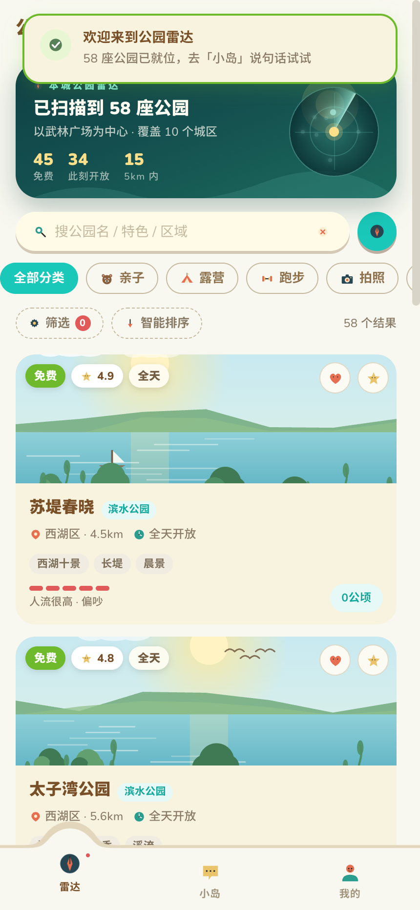
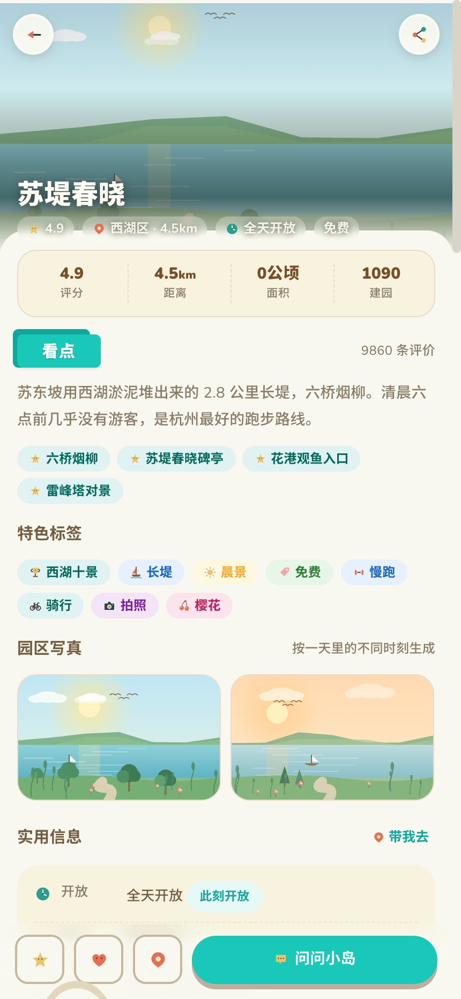
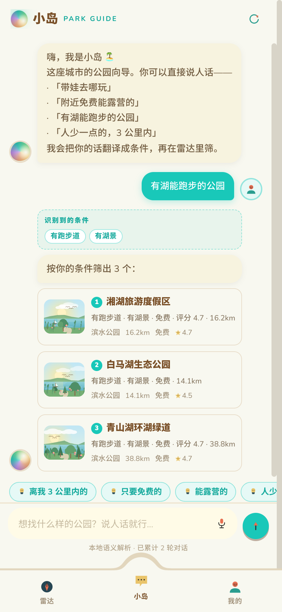
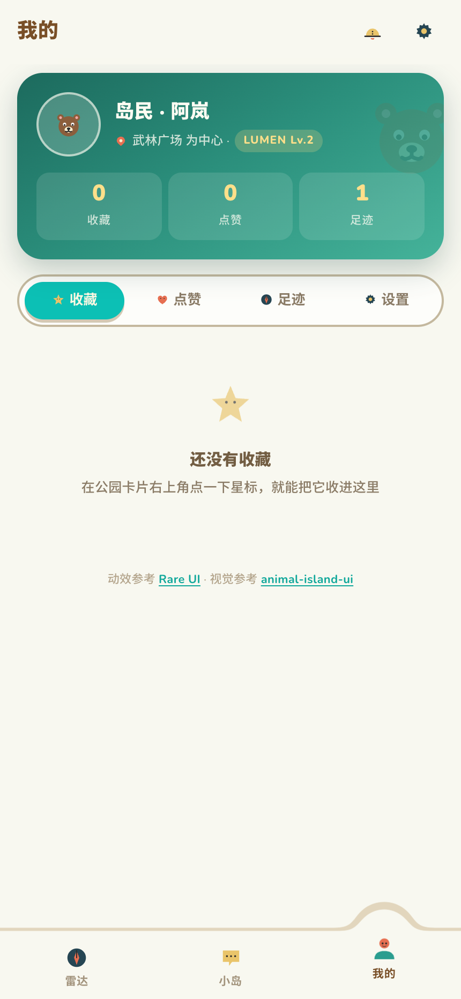

# 公园雷达 · Lumen

> 单文件离线 H5。58 座城市公园的列表 / 详情 / 我的（收藏 · 点赞 · 足迹）+ 一个会说人话的公园向导「小岛」。

打开 [`index.html`](./index.html) 即可运行 —— 无构建、无依赖、无接口调用、无外部图片。
所有公园插画、雷达图、地图与图标都在浏览器里实时生成。

```
park-radar-lumen/
├── index.html          # 产物：单文件应用（约 355 KB，直接双击可开）
├── src/                # 源码（构建时按序拼接）
│   ├── icons.js        #   125 个 naive-icons 字形（从官方 dist 抽取的内联 SVG）
│   ├── data.js         #   58 座公园数据集 + 中文语义词表
│   ├── core.js         #   DOM / 本地存储 / WebAudio / 动效引擎 / 路由
│   ├── art.js          #   程序化插画：风景、头像、示意地图
│   ├── agent.js        #   小岛：本地语义解析 + 排序 + 可解释推荐
│   ├── ui.js           #   外壳、列表页、详情页、筛选抽屉
│   ├── pages.js        #   我的、对话页、设置、启动引导
│   ├── base.css        #   animal-island-ui 设计系统复刻
│   └── app.css         #   应用外壳、页面与动效层
└── tools/
    ├── build.mjs       # 拼接成单文件 index.html
    ├── agent-test.mjs  # 79 项 headless 断言（解析 / 检索 / 对话 / 数据自洽）
    └── extract-icons.mjs
```

```sh
node tools/build.mjs        # 重新生成 index.html
node tools/agent-test.mjs   # 79 项断言
```

> `src/icons.js` 已经提交在仓库里，日常不需要重新生成。
> 只有想更新图标时才跑 `node tools/extract-icons.mjs`（本地找不到 naive-icons 的 dist 时会自动去 npm CDN 取）。

---

## 一、四个页面

<p align="center">
  
  
  
  
</p>
<p align="center"><sub>雷达列表 · 公园详情 · 小岛对话 · 我的（430×932 @2x）</sub></p>

| 页面 | 内容 |
| --- | --- |
| **雷达（列表）** | 雷达总览卡（旋转扫描 + 光点 + 实时统计）、搜索、10 个分类快捷轨、筛选抽屉（价格 / 距离 / 评分 / 设施 / 排序）、三种排序、下拉刷新、触底加载、空状态、骨架屏 |
| **详情** | 视差头图、四格数据、看点、特色标签、**一天四个时刻**的程序化写真、实用信息、人流/安静/遮荫三条体感刻度、设施宫格、示意地图、过来人建议（手风琴）、评价、附近推荐、底部悬浮操作条 |
| **我的** | 个人卡（等级随收藏+点赞增长）、收藏 / 点赞 / 足迹 / 设置四个分区、**左滑删除**收藏、足迹时间线、音效与动效开关、小岛的大脑（可选接入大模型）、清除数据 |
| **小岛（助手）** | 自然语言对话、**实时显示识别到的条件**、结果卡片可直接进详情、上下文连续追问、思考中的雷达动画、打字机逐字、快捷追问、语音输入（浏览器支持时） |

## 二、小岛怎么工作

默认是**本地确定性语义解析**：一句话 → 槽位（标签 / 类型 / 城区 / 设施 / 价格 / 距离 / 评分 / 开放时间 / 季节 / 人流 / 宠物 / 露营 / 跑步 / 排序 / 数量）→ 在 58 座公园上做 AND 过滤 → 打分排序 → 用模板把「为什么推荐」写出来。

诚实是它的硬约束：

- **严格匹配优先**。只有严格结果为 0，或用户明确说「放宽 / 太少了」时，才逐级放弃约束（距离 → 票价 → 评分 → 季节 → 开放时间 → 人流 → 公园类型 → 区域 → 设施 → 特色标签 → 宠物/露营/跑步 → 价格），并把**具体放宽了什么**写进回复；
- 结果只有 1–2 个时直说「完全符合的只有 N 个」，而不是拿泛结果充数；
- 放宽计算在过滤器副本上进行，**不会**悄悄改掉用户已说的条件；
- 每条推荐都附「免费 · 有草坪 · 3.2km · 评分 4.8」这类**可核对**的理由，不编造。

```
带娃去哪玩              → 识别「适合遛娃」
附近免费能露营的        → 「免费 + 可露营 + 6km 内，按距离最近」
不要有樱花的，人少一点  → 负向条件 + 人流上限
推荐3个评分4.5以上的    → 数量 + 评分门槛
太子湾公园怎么样        → 直接给详情
太子湾和花港观鱼哪个好  → 并排对比
还有吗 / 放宽一点 / 清空 → 对话控制
```

> **可选的大模型解析**：`我的 → 设置 → 小岛的大脑` 可填任意 OpenAI 兼容接口（地址 / 模型 / Key，只存在本地 localStorage）。启用后先把话发给模型转成同一套槽位 JSON，任何失败或超时（9s）都会**自动回退**本地解析。默认关闭，纯离线。

## 三、动效：Rare UI 机制的对照实现

参考 [Rare UI](https://rareui.com)（`swamimalode07/rare-ui`，MIT + Commons Clause + Attribution）。原组件基于 React + Motion，这里用**原生 CSS / SVG / Web Animations API** 重写为无框架版本，并替换为动物岛配色与图标：

| Rare UI 组件 | 这里的落地 | 机制 |
| --- | --- | --- |
| `gooey-nav` | 底部标签栏 | SVG `feGaussianBlur + feColorMatrix` 阈值化成流体，圆球以 `cubic-bezier(.34,1.5,.5,1)` 滑到当前 tab，与栏体粘成「连接颈」 |
| `emoji-reaction` | 点赞 / 收藏 / 移除的粒子迸发 | 每次 15–18 颗粒子，角度散布、`travel + drift` 位移、`tilt` 摇摆、`scale` 包络、`blur` 淡出，逐个随机时长与延迟 |
| `animated-counter` | 我的页三个统计数字 | 每位数字一条 0–9 竖条，`translateY` 按位错峰（55ms/位）滚到位 |
| `grid-reveal` | 列表卡片入场 | `IntersectionObserver` + `clip-path: inset()` 由下向上揭开 + 位移缩放，按索引错峰 |
| `fluid-orb` | 小岛的头像 | 8 点 `border-radius` 变形关键帧 + 缓慢自转的 conic 渐变 + 高光块 |
| `scroll-progress` | 详情页顶部进度 | 滚动位置经 0.18 阻尼插值（弹簧感），并随段落切换小标签 |
| `proximity-sidebar` | 标签栏图标 / 分类 chip | 指针邻近时按距离抬升缩放 |
| `delete-button` | 收藏左滑删除 | Pointer Events 拖拽跟手 → 过阈值吸附展开并「上膛」→ 二次确认 |
| `notification-bell` | 顶栏铃铛 | 徽标 + 周期性摇摆，抽屉式消息中心 |
| `bounce-sidebar` | 详情底部操作条 | 入场回弹 |
| `voice-note` | 对话页语音输入 | 按住脉冲态 + 真实 Web Speech API（不可用时明确提示，不假装） |

另外自制了本主题的**雷达扫描**：旋转 `conic-gradient` 波束 + 同心环 + 十字准星 + 随机光点脉冲。

## 四、视觉：animal-island-ui 规格复刻

按 `guokaigdg/animal-island-ui` 的设计系统文档逐值实现，不引入该库：

- `:root` 全量 token（薄荷青 `#19c8b9`、羊皮纸底 `#f8f8f0` / `rgb(247,243,223)`、暖褐文字 `#794f27`–`#9f927d`、`--animal-ease: cubic-bezier(0.4,0,0.2,1)`）；
- **3D 像素堆叠阴影只给主按钮**（`0 5px 0 0 #bdaea0`，hover 6px、active 1px）；默认/虚线/文字按钮只用软投影 `0 2px 4px rgba(61,52,40,.06)`；
- Card 无阴影，20px 圆角，hover 仅 `translateY(-2px)`；pattern 变体用双层径向点阵 + 1.5px 同色描边；
- 输入框 50px 胶囊、无阴影（`input--shadow` opt-in）、**黄色**聚焦 `#ffcc00`，绝不用蓝色聚焦环；
- Title 燕尾绶带（`clip-path` 鱼尾 + 折角三角 + `perspective(11.5em) rotateX(3deg)`）；Modal 用官方 **SVG 水滴 blob clip-path**；Drawer 带背景下沉 `translateY(24px) scale(.96)` + `brightness(.85)`；
- 字号字重守住「正文 500 / 按钮标题 600–700 / 数字 900 / 占位 400，不低于 400」；全局零纯黑文字、零冷灰背景（已由自动化断言校验）；
- 图标取自 **naive-icons 的 125 个字形**（`tools/extract-icons.mjs` 从官方 dist 抽取为内联 SVG），不用 emoji、不手搓图标。

**有意的偏离（2 处）**，其余均按规格：

1. **不用 React + Babel CDN 的单文件方案**，改为原生 JS 手写组件类。原因是本仓库其它案例以「单文件零外部资源、离线可跑」为准；React + Babel 需联网且首屏多 ~1.5 MB。视觉与交互仍按同一套规格实现。
2. **新增深青色「仪表盘」面板**（雷达卡、个人卡）。规格里没有暗色面板，但它来自主色系（`#0f3f43 → #1c6a5d`），用来给信息分层，并规避冷灰。

## 五、数据

58 座杭州公园，10 个城区，坐标取自真实近似位置（用户位置假定为武林广场，距离用 haversine 实算）。字段包括：类型、城区、票价、开放时间、面积、建园年份、标签（120 个）、设施、人流 / 安静 / 遮荫（1–5）、最佳季节、宠物 / 露营 / 跑步 / 儿童区、看点、建议、交通、电话、车位数。

**数据集是演示用途**，坐标与票价是近似值，请勿作为出行依据。

## 六、验证

- `node tools/agent-test.mjs` —— **79 项全过**：词表映射到真实数据、每种槽位的解析、**严格结果必须满足全部已述条件**、放宽必须被披露、连续追问、对比、详情、每个公园都能被名字检索到、乱码与不可能条件不崩。
- 浏览器回归（390×844 iPhone 视口，Playwright/agent-browser 驱动）：控制台**零报错、零未捕获 Promise**；详情/返回/收藏/点赞/粒子回收/左滑删除/手风琴/两个弹窗/搜索/排序/筛选/加载更多/骨架屏/抽屉/设置开关/深链 `#/park/:id` 与 `#/agent` 全部通过；320 / 375 / 414 / 600 / 768 / 1280 六档宽度**均无横向溢出**，>520px 时收成 480px 居中壳。

## 七、版权与致谢

- 视觉规范：[animal-island-ui](https://github.com/guokaigdg/animal-island-ui)（MIT）—— 设计 token 与组件规格；
- 动效机制：[Rare UI](https://rareui.com)（MIT + Commons Clause + Attribution）—— 已在此署名并保留说明；
- 图标：[naive-icons](https://www.npmjs.com/package/naive-icons)（MIT）—— 字形已内联，未引入运行时依赖；
- 字体：Nunito + Noto Sans SC，通过 Google Fonts 渐进加载；离线时回退系统圆体，布局与配色不受影响。

公园数据为演示用途原创整理。
