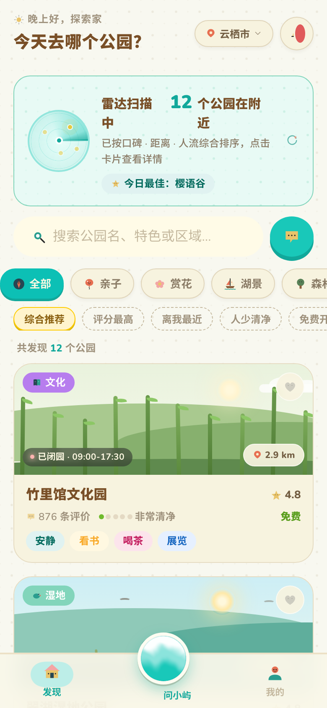
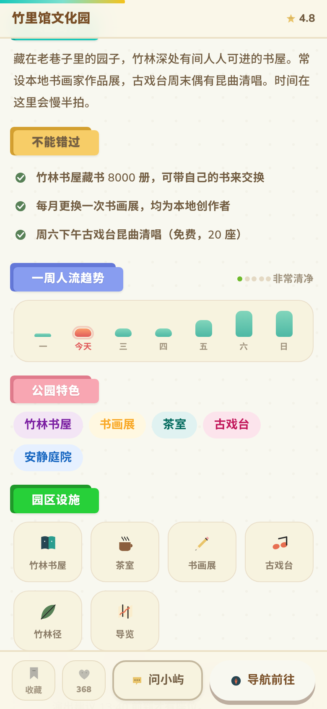
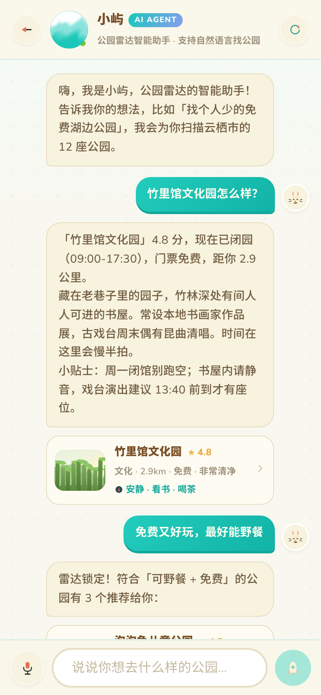
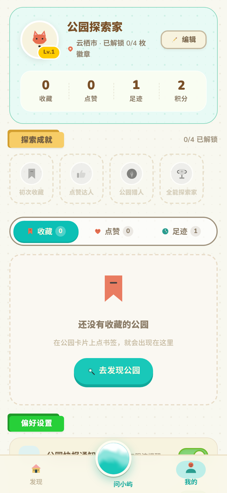

# 公园雷达 · ParkRadar

一个「动物森友会」风格的公园发现 H5 应用原型 —— 单文件、移动端优先、内置 AI 智能助手。

> **打开方式**：直接双击 [`index.html`](./index.html)（或部署到任意静态服务器）。
> 首次加载需要联网（React 18 + Babel 走 unpkg CDN），之后浏览器有缓存。

   

---

## 功能一览

### 发现（列表页）
- **雷达扫描横幅**：品牌签名细节，扫描环 + 光点脉冲，点击可重新扫描
- 12 座虚构公园（云栖市），**纯 CSS/SVG 程序化场景画**——樱花飘落、湖光潋滟、萤火闪烁、摩天轮旋转，每座公园一张独立配色的「岛屿画风」卡片，零图片资源
- 搜索（名称/特色/区域模糊匹配）· 9 类分类 chips · 5 种排序（综合/评分/距离/人少/免费）
- 卡片入场瀑布动画、点赞心形粒子爆发、营业状态实时计算

### 公园详情页
- 300px Hero 场景 + 滚动视差 + 顶部阅读进度条 + 滚动后浮现紧凑标题栏
- **数字滚轮（odometer）**统计带：面积 / 评价数 / 点赞数
- 一周人流趋势柱状图（今天高亮）· 亮点清单 · 设施矩阵 · 游玩贴士
- 评论列表（逐条点赞、粒子反馈）· FAQ 手风琴 · 相似公园推荐
- 底部操作栏：收藏（星形粒子 + 浮字）/ 点赞 / 问小屿 / 导航

### 智能助手「小屿」（Agent）
- **本地规则 NLU，完全离线可用**：
  - 条件检索：`附近人少的公园` `适合遛娃的` `免费又好玩，最好能野餐` `可以带狗吗` `晚上哪里有夜景`
  - 公园直查：`翠湖湿地公园怎么样`（别名/简称模糊匹配）
  - 上下文指代：`第一个怎么样` `换一批` `有相似的公园吗` `今天人多吗`
  - 个人数据：`我的收藏` `我点赞过的` `我的足迹`
  - 闲聊兜底：问候 / 感谢 / 帮助 / 下雨天推荐
- 条件解析 → 加权评分排序 → 每个结果附「推荐理由」卡片 → 跟进 chips 引导多轮对话
- 打字机逐字回复 + WebGL 流体球形象（不支持 WebGL 时自动降级为 CSS 渐变球）
- 模拟语音输入（演示）
- **可选接入真实 LLM**：在控制台执行
  ```js
  localStorage.setItem('park-radar:llm', JSON.stringify({
    baseUrl: 'https://api.openai.com/v1',  // 任意 OpenAI 兼容接口
    apiKey: 'sk-...', model: 'gpt-4o-mini'
  }))
  ```
  之后小屿优先走 LLM（失败自动回退本地引擎）。

### 我的
- 资料卡（等级随行为成长）+ 四项统计（数字滚轮）
- 探索成就徽章 ×4（解锁/未解锁态，条件驱动）
- 收藏 / 点赞 / 足迹三个列表，支持滑动式移除（折叠动画）
- 设置：快报通知、足迹记录、**减弱动效**（一键全局降级动画）
- 清除数据（blob 弹窗二次确认）· 关于（版权与致谢）

### 交互骨架
- 底部**粘滞导航（gooey tab bar）**：切换时液滴拉伸融合，中央流体球直达助手
- Hash 路由（`#/`、`#/park/:id`、`#/me`、`#/chat?q=...`），支持深链与浏览器前进后退；详情与聊天可堆叠互盖
- localStorage 持久化：收藏/点赞/足迹/设置/聊天记录
- 桌面浏览器打开时自动呈现居中「手机相框」布局

## 设计与技术

| 层 | 说明 |
|---|---|
| 视觉系统 | 严格遵循 [animal-island-ui](https://github.com/guokaigdg/animal-island-ui)：羊皮纸底色 `#f8f8f0`、薄荷主色 `#19c8b9`、棕色文字族（无纯黑）、黄色焦点（无蓝色）、胶囊圆角、主按钮 3D 像素投影 `0 5px 0 #bdaea0`、卡片无阴影、SVG blob 弹窗、燕尾丝带标题、13 色波点壁纸 |
| 特效动画 | 移植自 [Rare UI](https://rareui.com)：Fluid Orb（GLSL fbm 噪声着色器）、粒子爆发（emoji-reaction 手法）、数字滚轮（animated-counter）、粘滞导航（gooey-nav 的 SVG filter 手法） |
| 图标 | [naive-icons](https://github.com/guokaigdg/naive-icons)（MIT），77 枚内联 SVG，无 emoji 充当图标 |
| 架构 | React 18 UMD + Babel Standalone，**单文件 264KB**，无构建依赖、无本地资源请求，`file://` 双击即用 |
| 源码组织 | `parts/` 目录分片（tokens → 组件 → 页面 → 动画 → 数据 → 核心 → NLU → UI → 页面 → 路由），`./build.sh` 顺序拼接为 `index.html` |

修改源码后运行：

```bash
./build.sh   # 重新生成 index.html
```

## 许可与致谢

- 设计语言：[animal-island-ui](https://github.com/guokaigdg/animal-island-ui) · MIT License
- 动效参考：[Rare UI](https://rareui.com)（依其许可要求保留可见署名，见应用内「我的 → 关于公园雷达」）
- 图标：[naive-icons](https://github.com/guokaigdg/naive-icons) · MIT License
- 城市「云栖市」与全部公园、评论、数据均为虚构，仅作演示。
